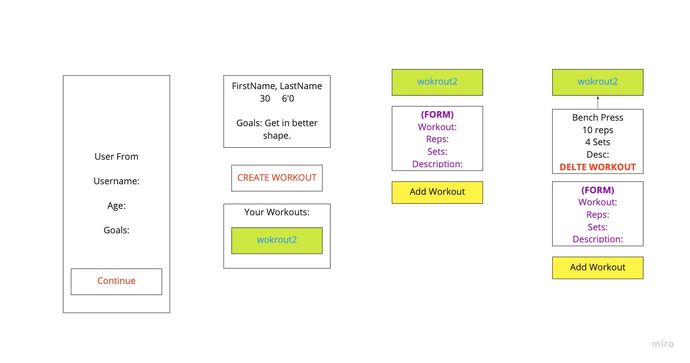

# Project 3

## Requirements

- App is fully deployed (both front and back)
    - Backend using `Heroku`
    - Frontend using `github`
- Include a 'planning/' directory
    - paragraphs addressing the general approach you took
    - link to user stories - who are your users? what do they want? why?
    - link to the React Architectures - diagram of your React Architecture
    - link to your wireframes
    - link to your time/priority matrix
    - table including functionality and estimated/actual time for completion
    - descriptions of any unsolved problems or hurdles your team had to overcome
- README that adequately documents the project
- roughly equal commit history between team members
- a Team page to show-case each team member's picture, passion, and contribution to the project
- two separate repos, one for back, one for front

### Back-End Requirements

- Node, Express, and Mongoose API with at least 2 models, more if needed, and one association
- must have CRUD (create, read, update, delete) functionality throughout the project (where it makes sense)
- repository should include
    - working JSON API (built by your team using `Express` and `Mongoose`)
    - frequent commits dating back to the beginning of the project
    - 

### Front-End Requirements

- Must use React and leverage the backend API
- Must use React Router to handle multiple views
- Must communicate with the back-end API RESTfully to CRUD resources (using either `fetch` or `axios` )


***

## Project Description

- Work out app
    - A workout app where users can input their own workouts, each workout can be divided into two types, cardio and weight-lifting. Weight-lifting workouts will include a section for workout, reps and sets and each cardio workout will include a workout, distance, time. Users can also add a description for each workout.

### Workout Schema

**User**
| First Name | Last Name |  Starting Weight |Goals  |
| ---------- | --------- | :------: | ---------------- |
| Robert | Lopez | enter goals here | ### | 
| Isaiah | Keller | generally more fit and healthy | 210 |
| Garrett | Pyke | goals | ### |
| Corey | Villanueva | goals | ### |


**Weight Lifting**
| Exercise    | Reps     | Sets     | Weekdays | Description        |
| ----------- | :------: | :------: | :--------: | ------------------ |
| Bench Press |   9-12   |    3     | Monday | Lay on bench, push weights up, short rest time ( under 45 sec ) |


**Cardio**
| Exercise    | Reps     | Sets     |
| ----------- | :------: | :------: |
| Bench Press |   9-12   |    3     |

***

## Wireframes




## Minimum Viable Product (MVP/Post MVP)

- 'Planning' directory
    - general approach
    - link to user stories
    - link to the React Architectures
    - link to wireframes
    - link to time/priority matrix
    - table including functionality and estimated/actual time for completion
    - descriptions of any unsolved problems or hurdles that were overcome
- README.md that adequately documents the project
- Team page

### MVP Backend

- Backend Framework
- Exercise DB
- User DB
- Testing API
- Deployment to Heroku

### MVP Frontend

- Landing Page
- Form for entering user info
- Home page 
    - displays user data
    - add workouts
    - list 
- Testing App
- Deployment to Github

### Post MVP 

- Workouts by day of the week
- Separate workout types 
- Goal reps and sets vs accomplished
- 

***

## Components

| Component              | Priority | Estimated Time | Time Invested | Actual Time |
| --------- | :------: | :------: | :------: | :------: |
**MVP**
| Planning Directory | High | 4.5hrs |
| - general approach | High | 30min |
| - wireframes | High | 45min |
| - React Architectures | High | 45min |
| - user stories | High | 30min |
| - time/priorities matrix | High | 45min |
| - functionality, estimated/actual time table | High | 45min | 
| - problems/hurdles description  | Medium | 30min |
| README | High | 2hrs |
| Team Page | High | 1.5hrs |
**MVP Backend**
| Backend Framework | High | 45min |
| API | High |
| MongoDB | High |
| API testing | High |
| Backend Deployment to Heroku | High | 1hr |
**MVP Frontend**
| React Framework | High | 1hr |
| Landing Page | High | 1hr |
| Home page | High | 2.5hrs | 
| App Testing | High | 
| Frontend Deployment to Github | High | 2.5hrs | 
**Post MVP**
| CSS - beyond basic | Low |
| Workouts by day of the week | Low |
| Separate workout types (cardio vs weights) | Low |
| Goal reps and sets vs accomplished | Low |


***

## Aditional Libraries


## Aditional API's


***

## Code Snippets

- Corey Villanueva
```js
    let code = 'here'
```

- Garrett Pyke
```js
    let code = 'here'
```

- Robert Lopez
```js
    let code = 'here'
```

- Isaiah Keller
```js
    let code = 'here'
```

