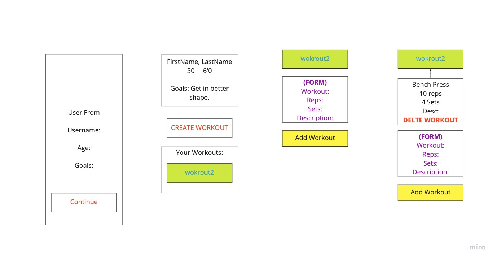
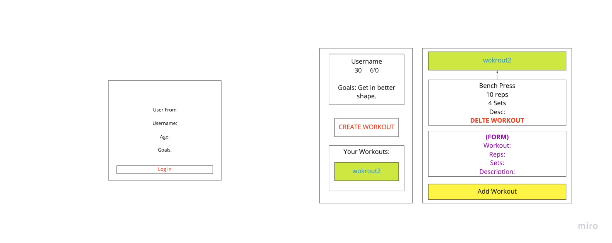

## Planning Directory

### General Approach

***
### User Stories

***
### Reach Architecture

***
### Wireframes

[- Wireframes on miro.com](https://miro.com/app/board/uXjVOHItXT8=/?invite_link_id=213180188513)

***
### Time/Priority Matrix

[- Time/Priority Matrix on Google Slides](https://docs.google.com/presentation/d/1CXTHjTzJ179aKc5salNZyDG0O8eZC2yhWKy7tu2evdA/edit?usp=sharing)

***
### Time/Priority Table

#### [Components](./../README.md#components)

***
### Unsolved Problems or Hurdles to Overcome

***
### Project Timeline

- On Monday we had our initial SCRUM and decided on a project in the morning.  The README.md was started over the weekend so we finalized the project and project description portions.  We started and completed the wireframes, filled out the 
